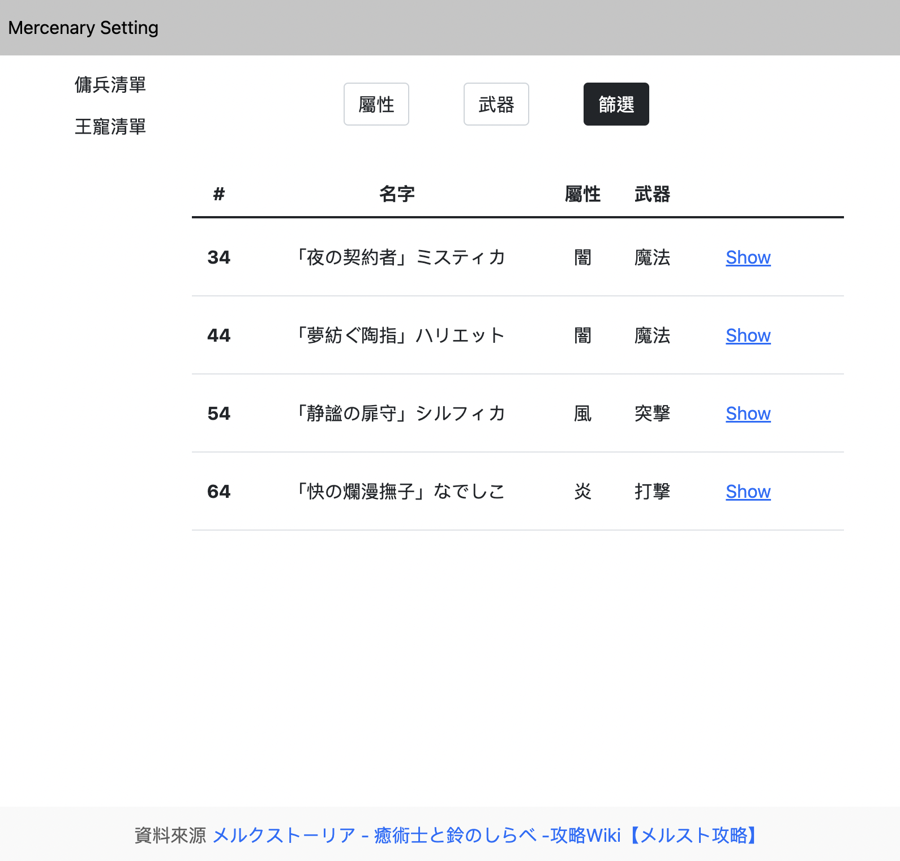

# 傭兵模擬器


***

## 使用者

* 以遊客身份登入瀏覽所有傭兵及王寵資料
* 利用傭兵屬性或是武器種類進行篩選
* 利用王寵屬性進行篩選
* 模擬組隊頁面中，以屬性進行篩選傭兵
* 登入後可以建立、修改及刪除傭兵或王寵
* 可以加入傭兵到隊伍中
* 我的傭兵中可以瀏覽所擁有的傭兵
* 模擬組隊頁面中，加上已擁有傭兵進行篩選

***

## 在本機運行伺服器

<br>

環境要求

* [npm](https://www.npmjs.com/)
* [node.js](https://nodejs.org/en/)
* [MySQL](https://dev.mysql.com/downloads/mysql/)
<br>

1. 下載專案<br>
```$ git clone https://github.com/eruc1117/mercenary_setting.git```
<br>
<br>
2. 安裝 Node package<br>
```$ cd mercenary_setting```<br>
```$ npm install --save```<br>
<br>
3. 完成資料庫架構設定 <br>
```npx sequelize db:migrate```<br>
<br>
4. 產生種子資料
```npx sequelize db:seed:all```<br>
<br>
5. 執行<br>
```npm run dev```
